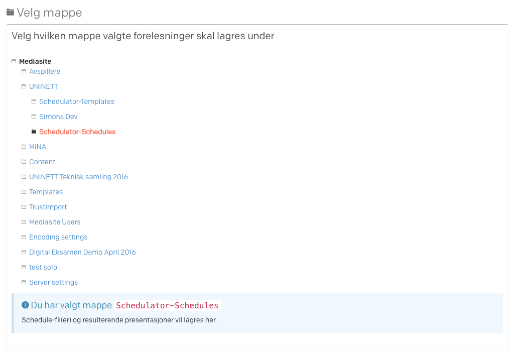

# UNINETT Mediasite Schedulator

This repo provides documentation and code samples from the (discontinued) UNINETT Mediasite Schedulator service; 
a client and "API" combo that enabled automated scheduling in Mediasite based on iCalendar (.ics) feeds. 

The service is explained in details further down. 
  
The UNINETT Mediasite Schedulator pilot was made available to the Norwegian Higher Education sector in 2013-2016.

**PLEASE NOTE**

The source code is made open to provide interested parties _examples_ only. API functions (in the `api` folder) would, as such, 
be of most value as it demonstrates how to access and talk to Mediasite's API.
 
While the source code is a near complete representation of the running pilot, it will not work out of the box! This is 
particularly true for the client, as it 

- depends on SimpleSAMLphp being installed on the server (and registered with FEIDE)
- a deprecated 3rd party API pertaining to UNINETTs own service register 

## Flow

### 1. Login

When accessing the client, the user will be redirected to Feide for authentication. This trip will pick up 

- user's org 
- whether the org subscribes to UNINETTs Mediasite service
- the URL to the Mediasite API for the org's instance 


Following a successful auth, the user is redirected back to the client where s/he is 
asked to authenticate the Mediasite API user. This requires a `username`, `password`, `api_key` for the org's 
Mediasite instance.
     


### 2. Wizard

The wizard guides the user through a number of steps, while collecting all information required in order to POST 
a scheduling request to Mediasite. 


#### 2.1 Calendar import

User must provide the URL to a calendar feed. This feed will be parsed and presented in the next view.

An iCalendar entry follows the following structure:

```
BEGIN:VEVENT 
   DTSTART:20150219T090000Z
   DTEND:20150219T103000Z
   UID:245885--432227791-0@timeedit.com
   DTSTAMP:20150218T000930Z
   LAST-MODIFIED:20150218T000930Z
   SUMMARY:ØKONOMI-101_VÅR_1\nBør Børson Jr.
   LOCATION:KRAMBUA
   DESCRIPTION:Hvordan bli generalmillionær på aksjespekulasjoner?
END:VEVENT 
```

The Schedulator will try to extract extra metadata from the fields `SUMMARY`, `DESCRIPTION` and `LOCATION`. 
  
#### 2.2 Choose lectures to schedule

Information in the feed is presented in a calendar view that can be filtered to include only pertinent lectures to be scheduled. 
Any calendar entries from the past are disabled (cannot schedule back in time;) 


#### 2.3 Set metadata fields

Calendar systems are used differently, and metadata such as title/description/presenter/tags and subject code may not be included at all 
or appear in any of the iCalendar fields `SUMMARY`, `DESCRIPTION` and `LOCATION` - as well as be separated by comma, tabs, newlines.

The Schedulator attempts to pull out as much detail as possible from the feed, but also allows the user to manually enter details 
if the feed content is insufficient: 


On this page, the user is asked to specify how the fields in the feed should be mapped to the metadata in the schedule.

#### 2.4 Output folder

Here, the client is talking to the API->Mediasite for the first time, requesting all folders on the system. 

The user is asked to select where the created schedules (and recorded presentations) should be stored in Mediasite:
 


#### 2.5 Select template

This view makes another call to API->Mediasite, requesting all templates available in the pre-defined templates folder.
 
The service expects the folder `/UNINETT/Schedulator-Templates/` to exist, and will list all templates in this folder.


#### 2.6 Select recorder

This view makes another call to API->Mediasite, requesting a list of all registered recorders. The user is asked 
to select which recorder(s) should be used. 

The Schedulator picks up from the calendar's `LOCATION` field if lectures are happening in different rooms. If this is the 
case, this view asks the user to select which recorder to be connected with which location. 


#### 2.7 Summary and submit

Throughout the wizard, the Schedulator has collected a lot of information to be POSTed to the API->Mediasite in order to create the Schedules. 

This view provides a summary, with the option to go back and change anything that needs changing.


When the user presses the button to schedule, an object of similar structure to the one below is POSTed to the API, 
which again makes successive calls to Mediasite's API for creating the various aspects of the schedule (e.g. `Tags`, `Presenters`, `Recurrence`) 

```json
{
  "meta": {
    "mediasite_root_folder_id": "__________",
    "mediasite_templates_folder_id": "__________",
    "ical": "url_to_ical_feed",
    "ical_feed": [
      {
        "uid": "16H-MAT-0001-1-1-2-3-1-w39@org.no",
        "start": 1474884900,
        "end": 1474891200,
        "summary": "MAT-0001-1-Gruppe 3 - A",
        "description": "Gruppe 3 - A",
        "location": "REALF A016",
        "laststart": null,
        "lastend": null,
        "recurrence": null,
        "recurex": null,
        "excluded": null,
        "added": null,
        "freq": null,
        "data": {
          "categories": "APPOINTMENT",
          "class": "PUBLIC",
          "dtstamp": "20160930T071501Z"
        },
        "previous_tz": "UTC",
        "tzid": "Europe/Oslo"
      },
      {
        "...AND SO ON" : "ALL ENTRIES IN THE ICAL FEED"
      }
    ],
    "lectures": [
      {
        "uid": "16H-MAT-0001-1-1-2-3-1-w44@org.no",
        "start": 1477912500,
        "end": 1477918800,
        "summary": "MAT-0001-1-Gruppe 3 - A",
        "description": "Gruppe 3 - A",
        "location": "REALF A016",
        "laststart": null,
        "lastend": null,
        "recurrence": null,
        "recurex": null,
        "excluded": null,
        "added": null,
        "freq": null,
        "data": {
          "categories": "APPOINTMENT",
          "class": "PUBLIC",
          "dtstamp": "20160930T071501Z"
        },
        "previous_tz": "UTC",
        "tzid": "Europe/Oslo"
      },
      {
        "...AND SO ON" : "ALL SELECTED CAL ENTRIES TO BE SCHEDULED"
      }
    ]
  },
  "schedules": {
    "REALF A016": {
      "recorder_id": "________",
      "recorder_name": "Mediasite-E2470",
      "recorder_version": "Mediasite Recorder 7.0.7 Build 1305",
      "lectures": [
        {
          "uid": "16H-MAT-0001-1-1-2-3-1-w44@uit.no",
          "start": 1477912500,
          "end": 1477918800,
          "summary": "MAT-0001-1-Gruppe 3 - A",
          "description": "Gruppe 3 - A",
          "location": "REALF A016",
          "laststart": null,
          "lastend": null,
          "recurrence": null,
          "recurex": null,
          "excluded": null,
          "added": null,
          "freq": null,
          "data": {
            "categories": "APPOINTMENT",
            "class": "PUBLIC",
            "dtstamp": "20160930T071501Z"
          },
          "previous_tz": "UTC",
          "tzid": "Europe/Oslo"
        },
        {
            "...AND SO ON" : "ALL LECTURES TO BE SCHEDULED WITH THIS RECORDER"
        }
      ],
      "recorder_operation_name": "Manually generate presentations",
      "auto_stop": false,
      "auto_start": false,
      "load_presentation": false,
      "create_presentation": false
    }
  },
  "subject": {
    "presenters": [],
    "code": "",
    "title": "Schedule opprettet 30.09.2016",
    "description": "Opprettet med Mediasite Schedulator"
  },
  "folder": {
    "id": "_______",
    "name": "Schedulator-Schedules",
    "description": "Output folder for Schedules opprettet med Schedulatoren. Denne er bare for intern testing. Normalt vil et lærested lagre sine Schedules i designert emnemappe."
  },
  "template": {
    "id": "_______",
    "name": "Multiview Player",
    "description": "Test template for Schedulator - aner ikke om dette er et bra oppsett... "
  }
}

```

## Service Components & Dependencies

**Components** 

1. A wizards-based web-client (HTML/JS/PHP), that talks with 
2. an API (PHP, see source folder `api`), that talks with
3. Mediasite's API (REST)

**Dependencies**

- SimpleSAMLphp (FEIDE)
- Access to UNINETT KIND registry (DEPRECATED, NO LONGER AVAILABLE)


## Credits

Client/API developed by Simon Skrødal for UNINETT AS. 

Special thanks to Ørjan Dypvik Pettersen & Roger Bråthen from Høgskolen i Narvik for concept, ideas, testing and feedback.

**3rd party**

_Client_:

The client is built using a modified version of [AdminLTE](https://github.com/almasaeed2010/AdminLTE), 
a free responsive admin template. Other libraries include:
 
- JQuery
- Bootstrap
- Datatables
- JSON Editor
- Moment.js

_API_:

The API makes use of [SG-iCalendar](http://github.com/fangel/SG-iCalendar) for parsing iCal calendar files.